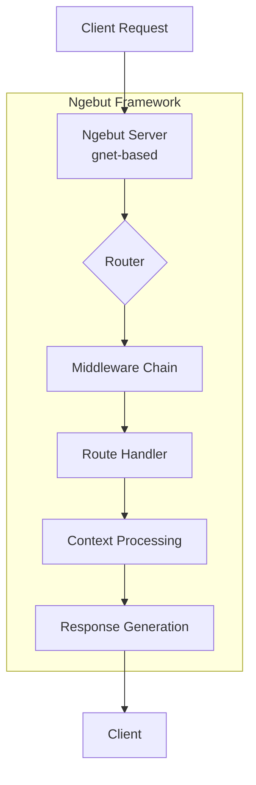

<p align="center">
  <a href="https://github.com/ryanbekhen/ngebut/releases"></a>
  <a href="https://pkg.go.dev/github.com/ryanbekhen/ngebut"></a>
  <a href="https://github.com/ryanbekhen/ngebut/blob/master/LICENSE"></a>
  <a href="https://goreportcard.com/report/github.com/ryanbekhen/ngebut"></a>
</p>

<p align="center">
  <b>Ngebut</b> is a web framework for Go designed for speed and efficiency.
  <br>
  Built on top of <a href="https://github.com/panjf2000/gnet">gnet</a>, a high-performance non-blocking networking library for Go.
</p>

> ⚠️ **Maintenance Notice**: Ngebut is currently under active development and maintenance. Some APIs may change before the first stable release.

## 📚 Documentation

For more detailed documentation, please visit the [Go Package Documentation](https://pkg.go.dev/github.com/ryanbekhen/ngebut).

## 🏗️ Architecture



> 💡 **Inspiration**: Ngebut is inspired by [GoFiber](https://github.com/gofiber/fiber) and [Hertz Framework](https://github.com/cloudwego/hertz), aiming to provide a similar developer experience while leveraging gnet for networking.

## ⚡️ Quick Start

```bash
# Install the framework
go get github.com/ryanbekhen/ngebut
```

## ✨ Features

- **Efficient Performance**: Built on gnet, a high-performance non-blocking networking library for Go
- **Simple API**: Intuitive and easy-to-use API for rapid development
- **Flexible Routing**: Supports URL parameters and all standard HTTP methods (GET, POST, PUT, DELETE, etc.)
- **Middleware Support**: Built-in middleware for access logging and session management
- **Group Routing**: Organize routes with groups that share common prefixes and middleware
- **Context-Based Handling**: Request and response handling through a powerful context object

## 🚀 Basic Example

For a quick start, check out this simple example:

```go
package main

import (
	"github.com/ryanbekhen/ngebut"
)

func main() {
	server := ngebut.New(ngebut.DefaultConfig())

	server.GET("/", func(c *ngebut.Ctx) {
		c.String("Hello, World!")
	})

	server.Listen(":8080")
}
```

## 📖 Documentation

For detailed documentation on server configuration, routing, middleware, and all other features, please refer to the [Go Package Documentation](https://pkg.go.dev/github.com/ryanbekhen/ngebut).

## 📊 Benchmark Comparison

Benchmark tests were conducted using [wrk](https://github.com/wg/wrk) with 4 threads for 10 seconds.

🌟 **Benchmark Environment** 🌟
- Device: MacBook Air M3
- Processor: Apple M3
- RAM: 16.00 GB
- Disk: 460Gi
- Operating System: darwin 15.5

### Text Endpoint (1000 connections)
| Framework | Requests/sec | Latency (avg) |
|-----------|--------------|---------------|
| Fiber     | 226,793.75   | 2.62ms        |
| Ngebut    | 130,606.36   | 7.06ms        |
| Net/HTTP  | 119,001.03   | 7.99ms        |

### JSON Endpoint (1000 connections)
| Framework | Requests/sec | Latency (avg) |
|-----------|--------------|---------------|
| Fiber     | 154,318.28   | 8.89ms        |
| Ngebut    | 120,485.89   | 6.35ms        |
| Net/HTTP  | 111,881.75   | 10.34ms       |

*Note: Benchmark results may vary based on hardware and environment. Ngebut is still under active development and performance optimizations are ongoing.*

## 🤝 Contributing

Contributions are very welcome! Please submit a Pull Request.

1. Fork the repository
2. Create your feature branch (`git checkout -b feature/amazing-feature`)
3. Commit your changes (`git commit -m 'Add amazing feature'`)
4. Push to the branch (`git push origin feature/amazing-feature`)
5. Open a Pull Request

## 📜 License

This project is licensed under the MIT License - see the [LICENSE](LICENSE) file for details.
